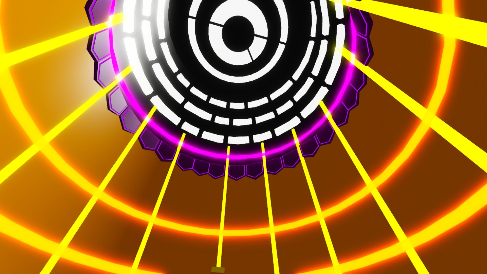
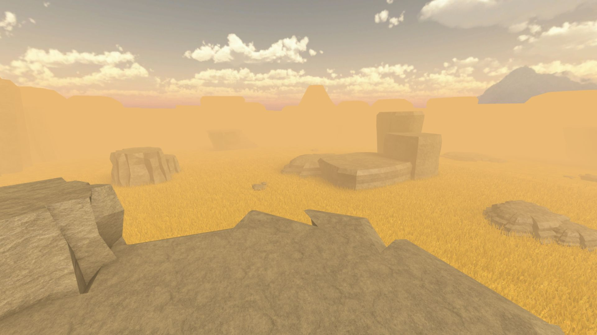
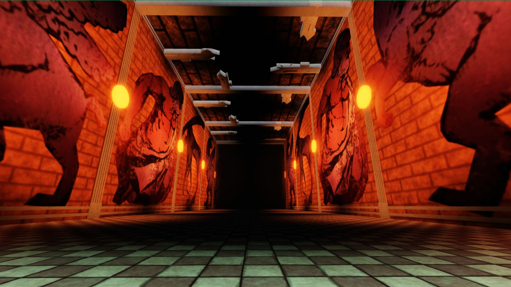
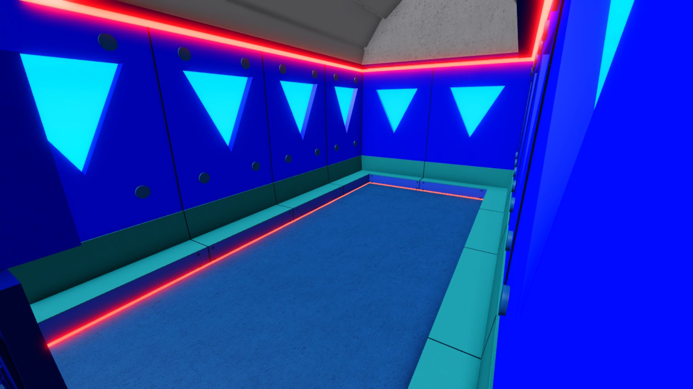
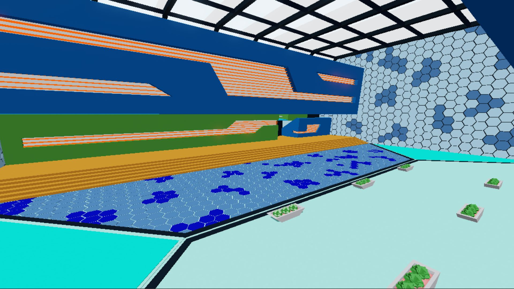
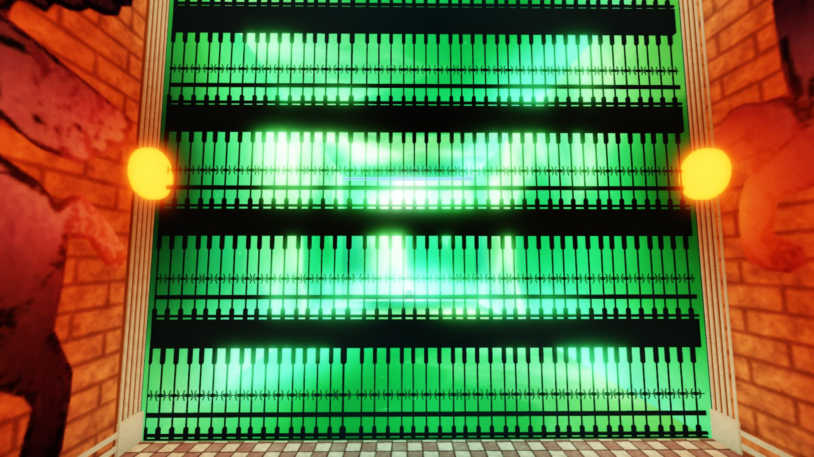

# Shin No Tower: Battleground Maps ⛩️
**Lead Builder & 3D Modeler | Roblox Studio**

A series of competitive battleground maps inspired by the *Tower of God* universe. This project translates the iconic floors of the tower into strategic combat environments, focusing on verticality, lighting-driven atmosphere, and diverse terrain types.

---

## 📸 Project Gallery
Below are highlights of the strategic battlegrounds designed for this experience.

| Sector | Technical Highlight |
| :--- | :--- |
|  | **Radial Lighting:** Complex emissive patterns designed to act as a central map focal point. |
|  | **Large-Scale Environments:** Custom terrain and rock formations for open-world combat. |
|  | **Storytelling:** Integrated environmental art into the architecture to drive immersion. |

<b>📂 Click to view full facility tour (Extra shots)</b>

### Interior Battlegrounds
* 
* 

### Mechanics & Gates
* 
* 

---

## 🛠️ Technical Specifications
* **Engine:** Roblox Studio
* **Focus:** Strategic Map Layout, Lighting-driven UX, and Terrain Optimization.
* **Assets:** Custom low-poly terrain, modular sci-fi panels, and atmospheric post-processing.

## 📂 Repository Structure
* `source/`: Contains the primary `.rbxl` map files.
* `documentation/`: High-resolution screenshots of various floors and sectors.
